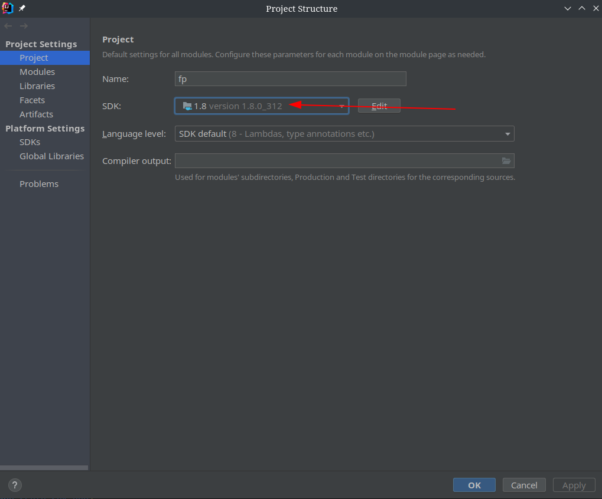
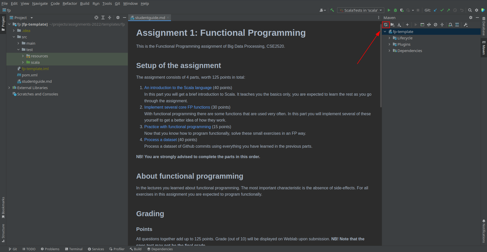
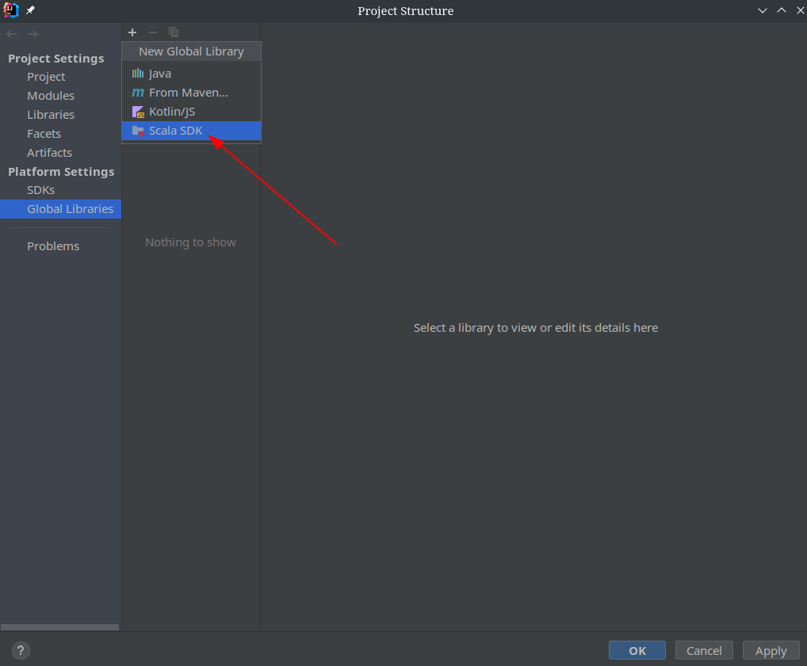
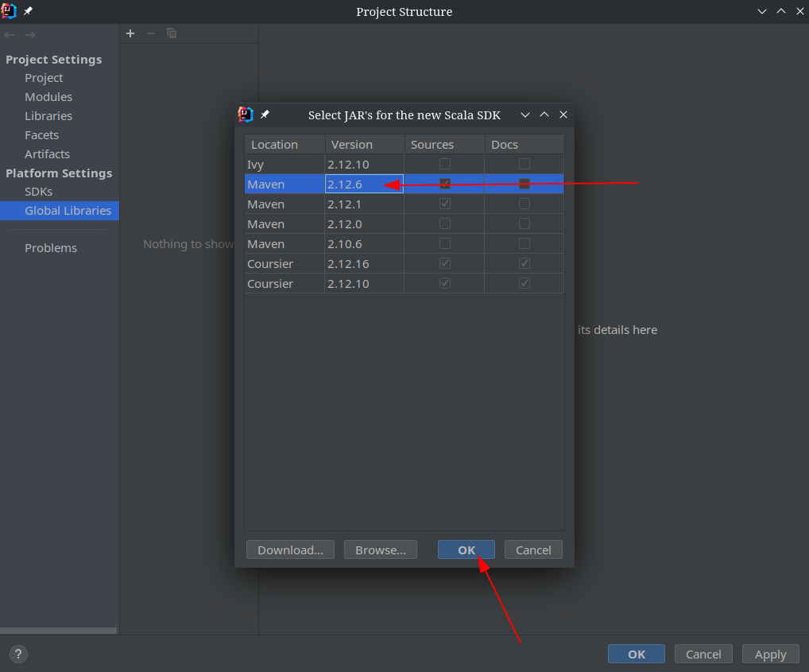

# Assignment 1: Functional Programming
This is the Functional Programming assignment of Big Data Processing, CSE2520.

## Setup of the assignment
The assignment consists of 4 parts, worth 125 points in total:

1. [An introduction to the Scala language](<src/main/scala/intro/readme.md>) (40 points)

    In this part you will get a brief introduction to Scala.
    It teaches you the basics only, you are expected to learn the rest as you go through the assignment.

2. [Implement several core FP functions](<src/main/scala/fp_functions/readme.md>) (30 points)

    With functional programming there are some functions that are used very often.
    In this part you will implement several of these yourself to get a better idea of how they work.

3. [Practice with functional programming](<src/main/scala/fp_practice/readme.md>) (15 points)

    Now that you know how to program functionally, solve these small exercises in an FP way.

4. [Process a dataset](<src/main/scala/dataset/readme.md>) (40 points)

    Process a dataset of Github commits using everything you have learned in the previous parts.

**NB! You are strongly advised to complete the parts in this order.**

## About functional programming
In the lectures you learned about functional programming.
The most important characteristic is the absence of side-effects.
For all exercises in this assignment you are expected to program functionally.

## Grading
### Points
All questions together add up to 125 points. Grade (out of 10) will be displayed on Weblab upon submission.
**NB! Note that the spec test may not be the final grade.**

### Handing in your solutions
Create a ZIP archive of the `src/main/scala` folder and upload this to Weblab.

### Weblab
After handing in your solutions, you can see the results of the automatic grading.
This only shows you an overall grade and which question(s) is/are incorrect,
but will not give details of the failures.\
Note that Weblab contains spec tests than the ones provided to you;
passing all provided tests does not mean you will get a 10.
You are encouraged to write more unit tests yourself to test your solutions.
You can find some help on writing tests in [test/intro/FunctionsTest.scala](<src/test/scala/intro/FunctionsTest.scala>)

**Warning**: Your solution on Weblab may fail if you do any of the following actions:
- change the names of template files
- change function signatures
- use external dependencies that were not in the original `pom.xml` file
- hand in your solutions in another format than the one specified earlier.
- code with infinite loops or code with memory leaks
- import libraries that are not provided to you

If you are in doubt why Weblab fails, ask the TAs for more details during the lab sessions.

### Programming style
Weblab only tests your solutions for correctness, it does not check your programming style.
Your solutions will be checked manually to verify you programmed functionally.
If not, points will be subtracted per question that violates the principles of FP.

Furthermore points may be deducted based on requirements set for the exercises, for example using library functions instead of implementing functions yourself.
These rules are specified in the template files, when applicable.\
When we mention that library functions are not allowed, any function from the Scala List API is forbidden
except for `::` (or the equivalent `+:`) and `:::` (or `++` or `++:`).
Using `.map`, `.filter` or any other function from the API will result in points being subtracted from your grade.

Hint: in previous editions of the course the most common mistake was to use mutation (i.e. variables).
Mutation is a side effect, therefore it is not good practice when programming functionally.\
Note that `for` and `while` loops use mutation.

## Tools and setup

### IDE
We recommend using IntelliJ for this assignment. If you do not already have this, you can apply for a student license on the [Jetbrains website](https://www.jetbrains.com/student/) and afterwards download IntelliJ there.

If you want to use another IDE, you are free to do so. Do not expect support from TAs however.

### Maven
The template project you are given contains a POM file for dependency management.
Using Maven, all dependencies will be resolved automatically.

### Setup process
1. Install IntelliJ.
2. Install the Scala plugin (IntelliJ -> Settings/Preferences -> Plugins -> Marketplace, search for "Scala"). This will restart IntelliJ.
3. Make sure to configure the `1.8` version of the Java JDK by navigating to 'File > Project Structure... > Project'.

4. After configuring the correct java version, open the maven menu on the right side of the screen and reload the maven project by pressing the 'refresh' button.

5. Next make sure to configure the right scala sdk by navigating to 'File > Project Structure... > Global Libraries'.

6. Make sure to add the sdk provided by maven.

7. You are ready to start working :)

